# 帮助

## 前言

iCalendar，简称"iCal"，是"日历数据交换"的标准，该标准提供了一种公共的数据格式用于存储与交换日历方面的信息，比如事件、约定、待办事项等。它的文件格式是
\*.ics

日历、日程功能作为一个基础服务，在 Windows、macOS、iOS、Android、Windows
Phone
等系统、以及各大邮箱服务都有着强大的原生支持。但它们上手起来对于初学的我们来说，还是有一点点门槛的，所以就有了本文。

本文档旨在提供一个完整的流程帮助大家把课表导入到日历中，教您打造一个**清晰展示**于手机/电脑中、**按时提醒**、**无副作用**(流氓推广、无用的社交功能、费电)的课程表。

通过这个过程同时还可以为我们对于邮件沟通、GTD
时间管理方法等等建立一个基本的概念，无论您日后选择科研道路，还是选择融入职场，都能为其打下一个良好的基础。

本文档分为两部分，一部分介绍 \*.ics
文件在不同系统下导入的操作，另一部分介绍如何实现日历在不同设备之间的云同步。

由于日历是一个基础服务，因而它的配置十分灵活，并不受教程的步骤限制，所以您可以自由发挥，本文档仅供参考。

> 首先先得出一个小结论 ;-)
>
> 易用程度：macOS = iOS \> Windows 10 \> Android

## 导入前您需要做的

<!-- TODO -->

点击开始使用，将您的课表转换成系统日历通用的 ics
格式文件，如图：

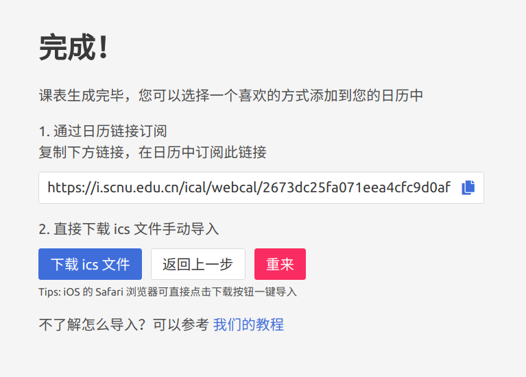

---

## 导入的步骤

这里以 Windows、Android、macOS 和 iOS 系统以及 Outlook
邮箱为例进行说明，选择适合您的一种方式即可。

若您希望在多个设备实现日历功能，可以通过在其中一个设备导入日历，再通过云同步的方式把日历同步到其它设备中。

### 通过 Outlook 邮箱导入

为什么选择微软的邮箱呢？因为在目前国内可用的邮箱中，唯有微软的 Outlook
邮箱支持导入 \*.ics 格式文件到日历中(最方便的 Gmail 被\...)

当然，如果您用的是 macOS/iOS 设备，或您有其它的软件可处理 \*.ics
文件，可直接跳过本步骤。

做完此步骤，您将拥有一个在线的日历账户，把它分别绑定到您的电脑和手机上，即可实现手机和电脑之间的课表同步。

1. 打开 [outlook.com](http://outlook.com)，若您以前没有注册过
   Outlook，可点击右上角注册

   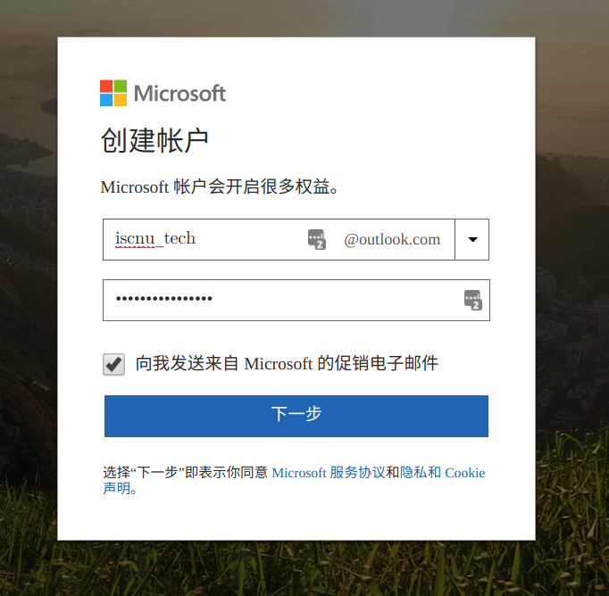

2. 点击左边栏的"日历"功能

   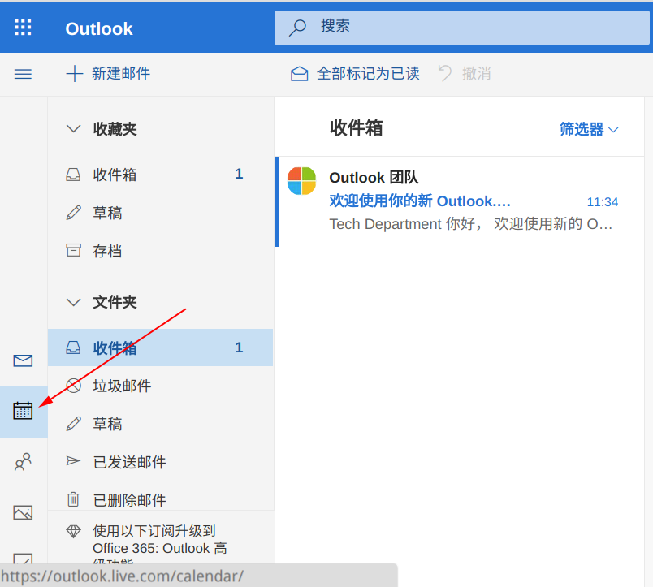

3. 取消 "试用 Beta 版" 的开关

4. 下面我们需要把时区设置为`东8区`避免时间错误，点击设置 \> 选项

   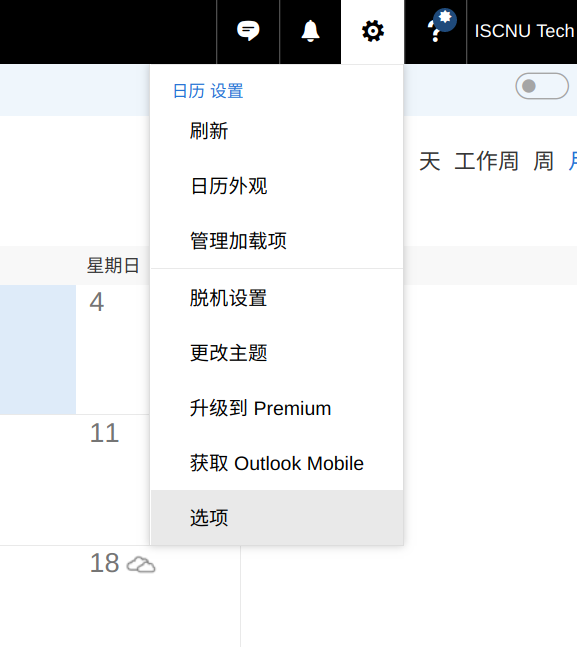

   在 常规 \> 地区与时区中，把设置改为下图所示，保存

   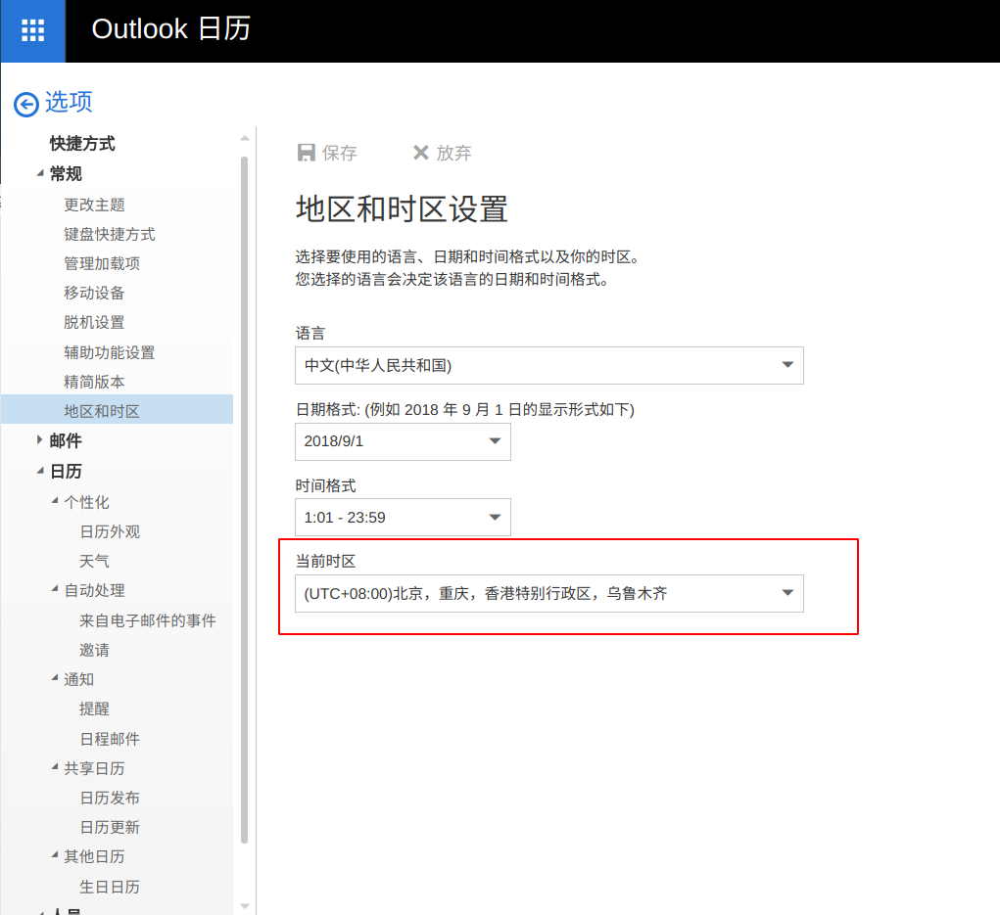

5. 回到日历界面点击添加日历 \> 二级日历，取名为"课表"

6. 点击 "发现日历" -\> "从文件导入" -\> 点击浏览，选择在本站导出的 ics
   文件 -\> 导入

   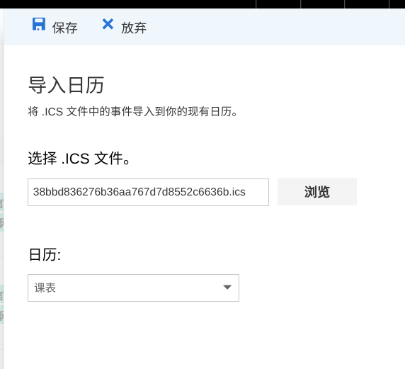

7. 完成

   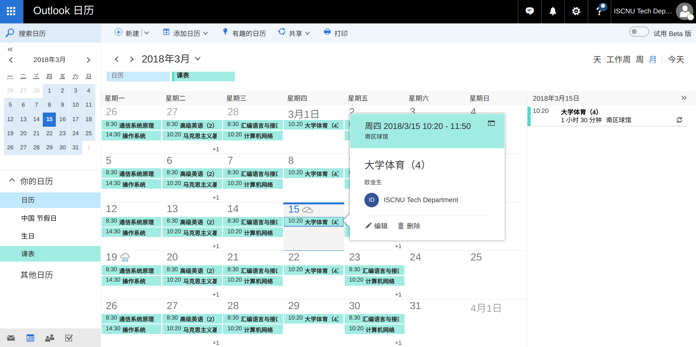

8. 如果您不希望 Outlook
   每天发邮件提示你的日程安排的话，可以在选项中关掉这个功能

   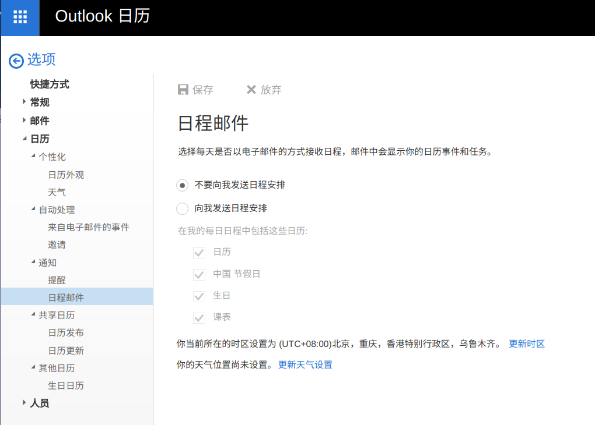

### Windows 下的导入

在 Windows 10 系统下，系统自带了一个日历应用，并支持直接导入 \*.ics
格式的文件，包括但不限于以下几种方式：

1. 通过上个方法把日历导入到 Outlook 邮箱中，再在 Windows 10 下添加此
   Outlook 邮箱，通过同步的方式增加课表
2. 若您需要与 iOS 设备同步，可在 Windows 10 日历应用下添加 iCloud
   账户同步手机上已导入的课表(参考本文档关于 iOS 的教程)
3. 直接把 ics 文件下载下来，在本地导入到 Windows 10 的日历应用中

若您以前从未使用过 Windows
自带的日历应用，并且对此无概念的话，建议您使用第 1 种方式

方法 2 与方法 1 可参考"日历的云同步"这一节

下面是方法 3 的具体操作过程

1. 双击下载的 ics 文件，此时日历应用会自动打开。

   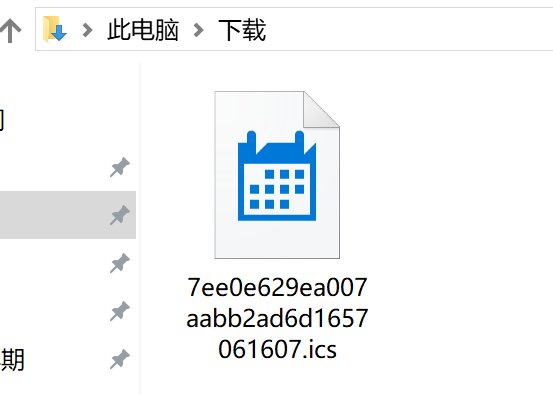

2. 检查事件是否完整，选择要添加到的日历，点击 "添加到日历" 即可。

   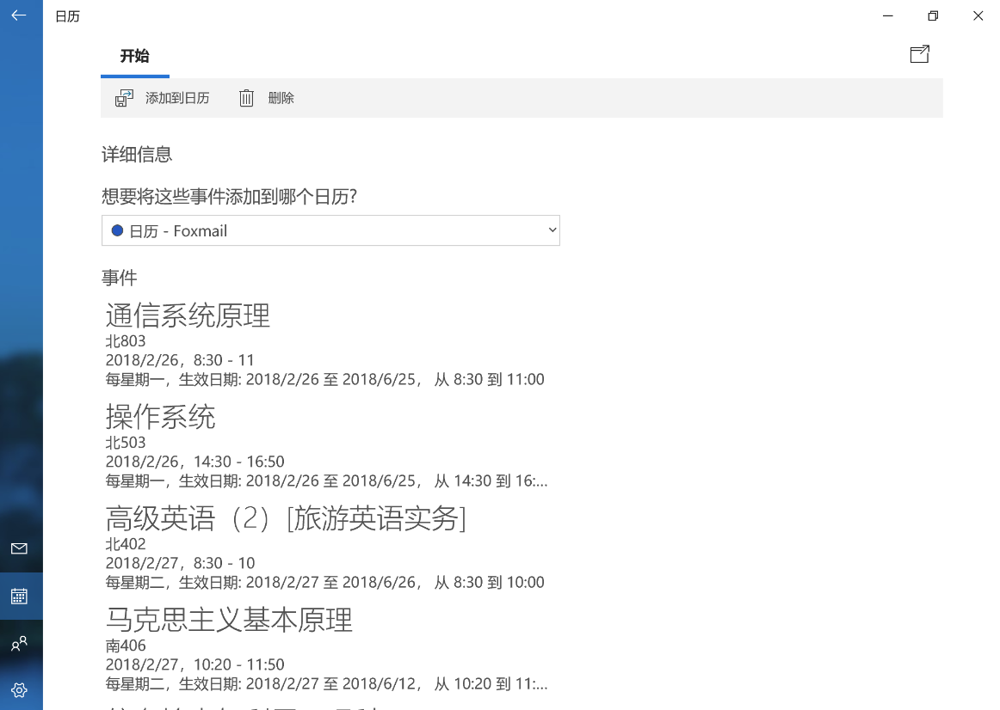

### macOS 下的导入

1. 打开系统自带的日历功能

   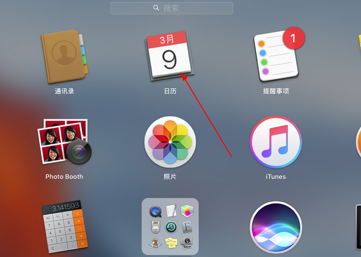

2. 在菜单栏中点击 文件-\>导入 选项

   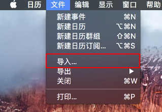

3. 找到下载的 ics 文件

   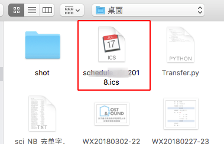

4. 完成

   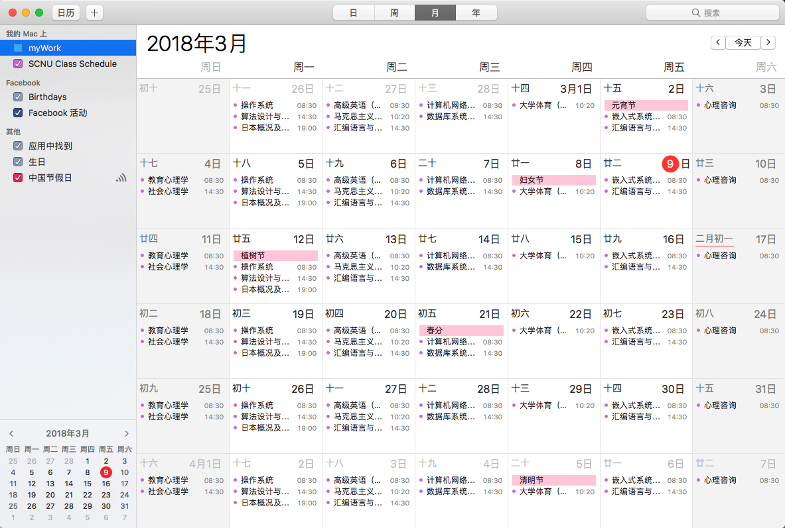

### iOS 下的导入

iOS 系统下目前有以下几种情况

1. 若您拥有 macOS
   的电脑，只要手机和电脑绑定了同一个 iCloud 帐户，电脑添加日历以后，日历将会自动同步，无需折腾。
2. 若您没有运行 macOS 的电脑，有 Windows 10 的电脑的话，可以在 Windows
   10 中的日历添加 iCloud 帐户实现（后文有详细说明）
3. 若您只有 iOS
   系统可以使用，可通过设置订阅本站提供的日历链接的方式来实现。

下面是方法 3 的操作流程（基于 iOS 11.2.6，在 iPhone X 下完成）：

1. 生成日历 ics 文件，复制日历链接

   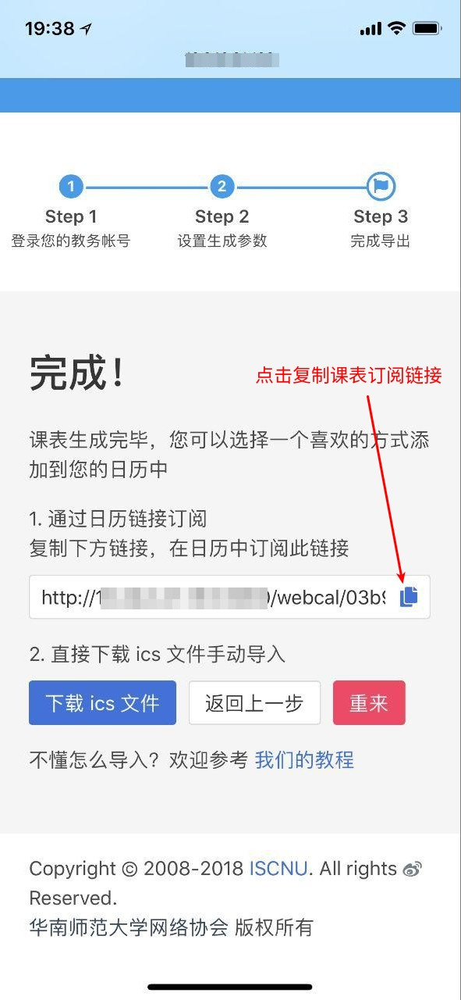

2. 打开"设置"，点击"帐户与密码"

   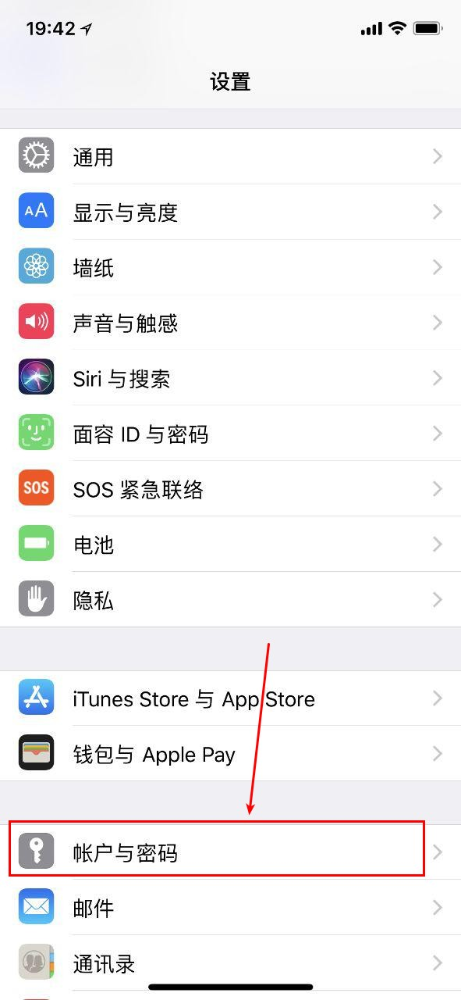

3. 点击"添加账户"

   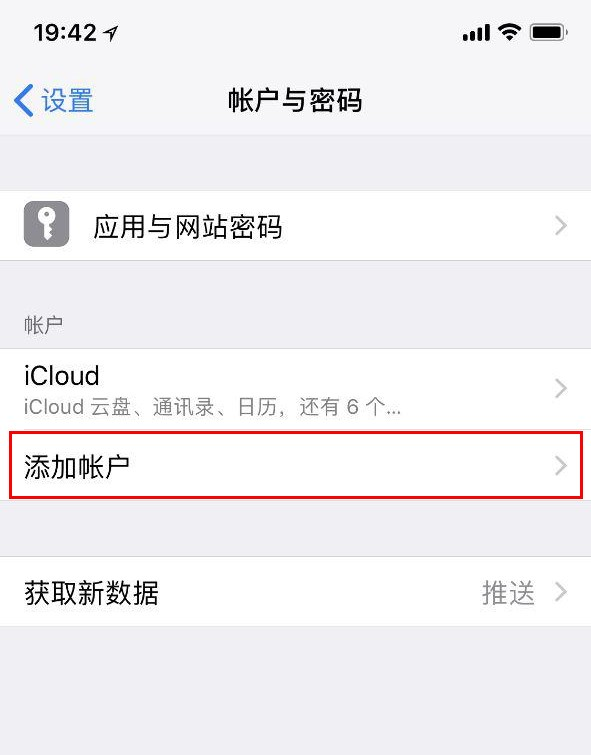

4. 滑动到页面最下方，选择"其他"

   

5. "添加已订阅的日历"

   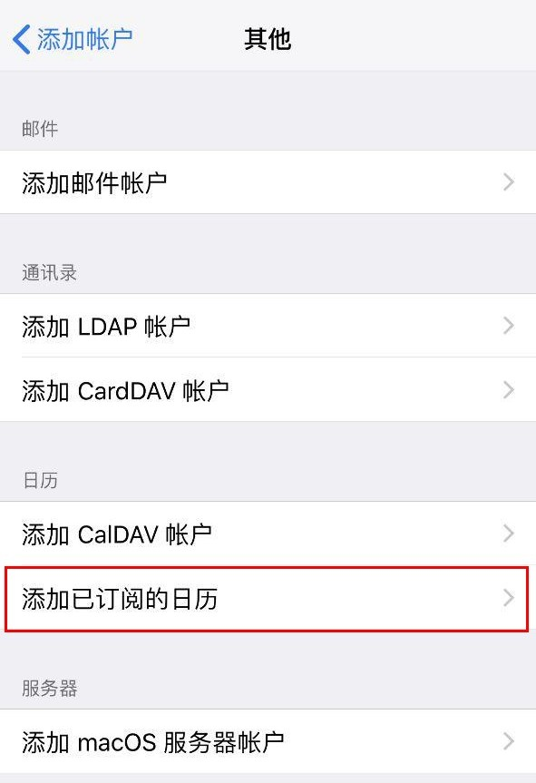

6. 粘贴第一步复制的链接，点击"下一步"

   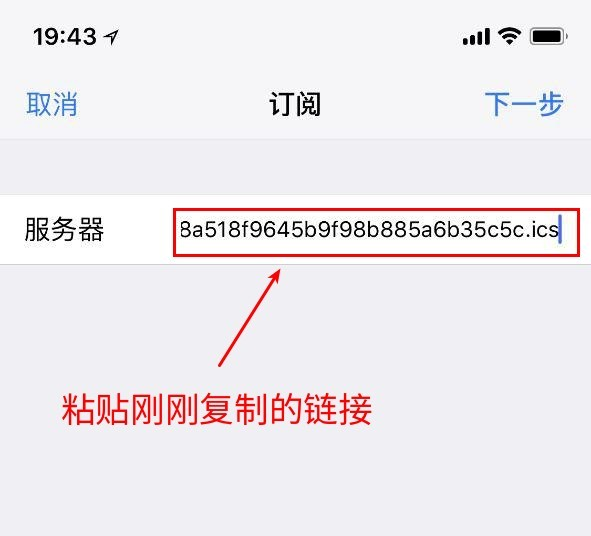

7. 点击"存储"，添加完毕

   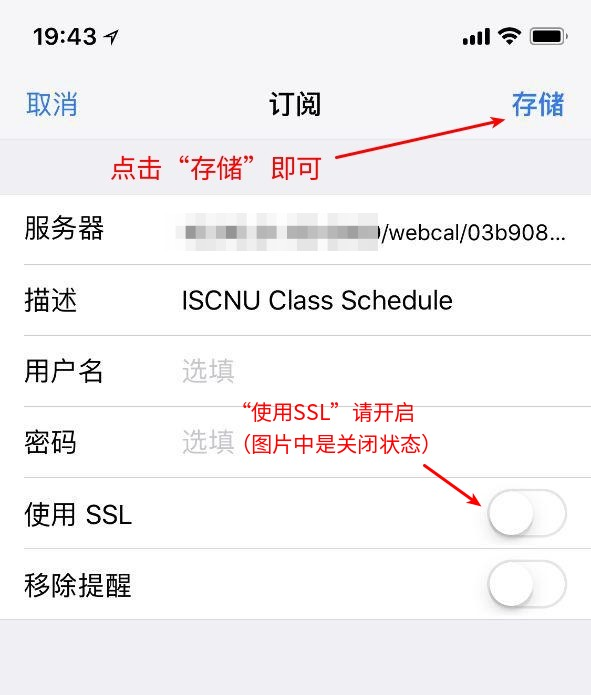

最后您可以在帐户页面的"已添加的日历"看到添加的课表

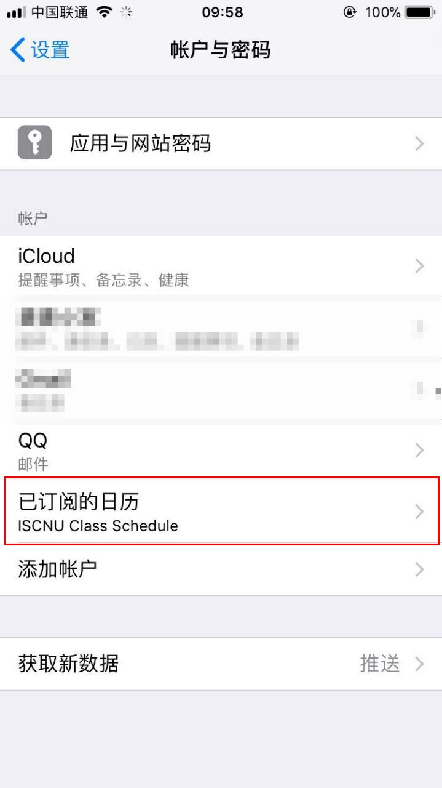

### Android 下的导入

由于 Android 系统机型众多，且许多"深度定制优化"的系统对日历的导入导出功能有着不同程度的阉割，所以操作的方法不一。

若您愿意花时间动手折腾，您可以在各大应用市场下载名为
`iCal Import/Export` 的应用实现导入。

若您不想折腾，有一个比较好的方法是，在电脑端导入好日历，再在手机上设置同步邮箱账户的方式，通过邮箱账户把日历自动同步到手机中。

账户绑定的方法在日历的云同步这一节有详细说明。

---

## 日历的云同步

日历云同步的功能，主要通过邮箱服务商提供的 Exchange 服务来进行（另：苹果
iCloud 也支持日历同步），所以只要您所有设备的日历客户端都配置了邮箱的
Exchange 服务的话，您的日程就能在其中实现云同步了。

邮箱的选择不限制，若您已经在其中的客户端导入了日历文件，那么选择一个你喜欢的邮件地址（如**华师 M 邮箱**、Gmail、QQ 邮箱、163 邮箱、Outlook 等等）；若您没有设备可直接导入 ics 文件，那么推荐您通过
Outlook 邮箱同步导入的课表。

服务的配置也十分简单，只需在本地添加一个基于 Exchange
服务，用以同步的邮箱帐户即可，下面将以 Outlook
邮箱为例，按照系统分别介绍。

### Windows 10

Windows 10 日历添加账户的方法较为简单，直接在日历设置中添加账户即可。

Outlook 邮箱直接用第一个选项，若您需要与 iOS 系统进行同步，请选择 iCloud

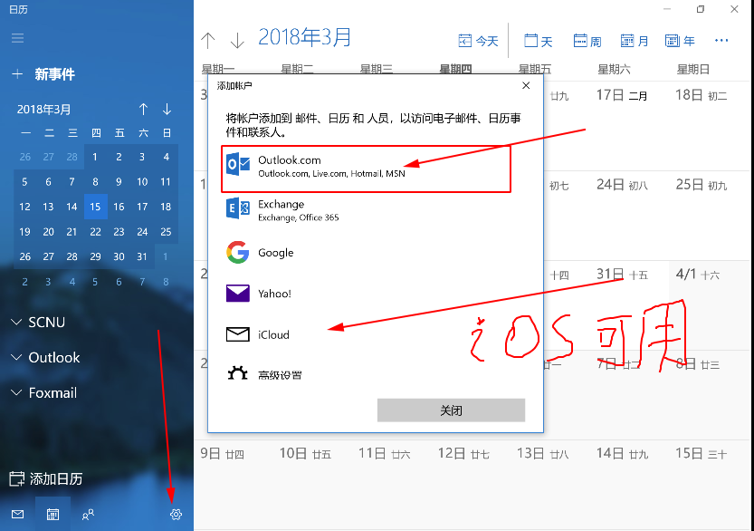

### iOS

iPhone/iPad 可以通过 iCloud 实现日历的同步，与 macOS 可以实现无缝结合。

如果您在使用 iPhone，但没有 Mac 电脑的话，有以下两种手段。

1. 若您使用 Windows 10 系统，您可以通过在 Windows 10 日历客户端中添加
   iCloud 帐户的方式实现，只需按提示输入帐户密码即可（具体请移步
   Windows 10 小节）。
2. 在邮件设置中添加邮箱帐户，参考微软 Office 文档 [使用 iOS
   邮件应用设置电子邮件](https://support.office.com/zh-cn/article/%E4%BD%BF%E7%94%A8-ios-%E9%82%AE%E4%BB%B6%E5%BA%94%E7%94%A8%E8%AE%BE%E7%BD%AE%E7%94%B5%E5%AD%90%E9%82%AE%E4%BB%B6-7e5b180f-bc8f-45cc-8da1-5cefc1e633d1)

### Android

用惯 Android 手机的朋友可能会注意到，在手机的设置界面有个 "账户与同步"
的功能，可能您不知道怎么用，这是 Android 系统中一个强大的基础服务，其中一个便是实现邮箱和日历的同步，当我们在其中绑定了邮箱帐户以后，邮件、日历、联系人便能通过邮箱进行同步了。

下面将以 MIUI 9 为例介绍绑定的流程：

1. 打开 设置 \> 账号 \> 同步界面，点击 "添加"

   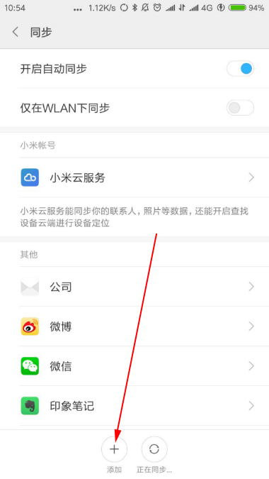

2. 选择"公司"

   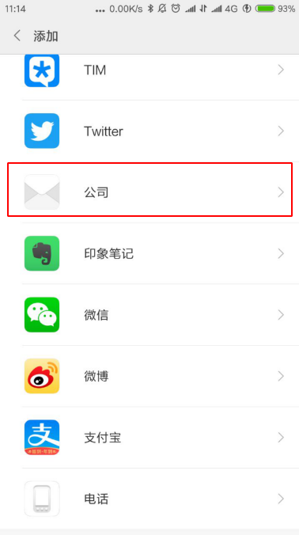

3. 添加邮件账户，输入刚刚注册的 outlook 邮箱账号，保持默认的 Exchange
   服务设置，点击登录。

   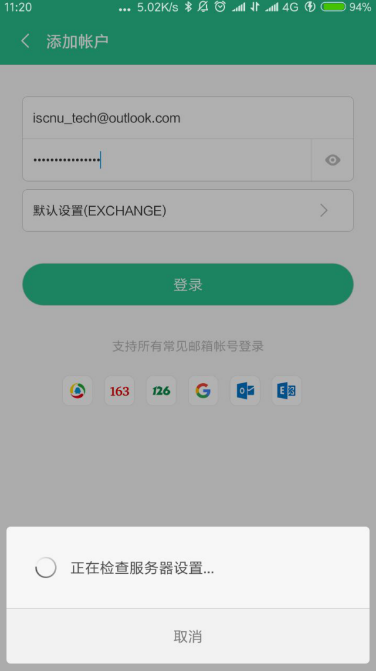

4. 登录以后，由于微软在强推自家的 Outlook
   客户端，所以还需要点击它发来的邮件确认才能启用同步。

   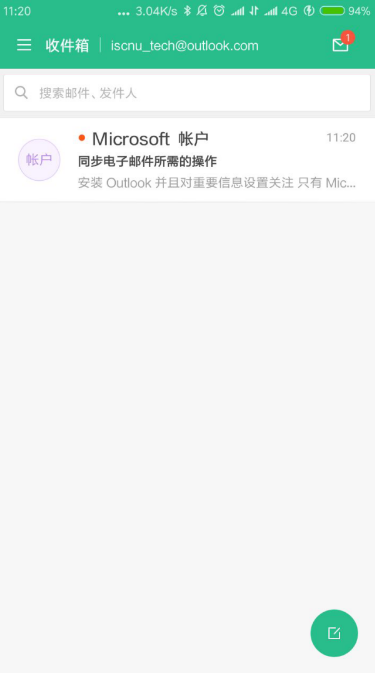

   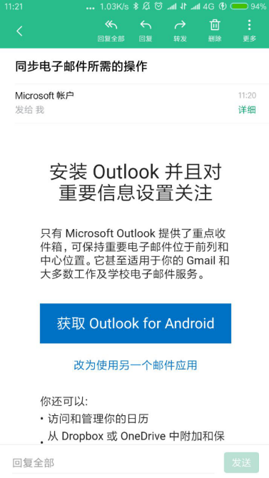

   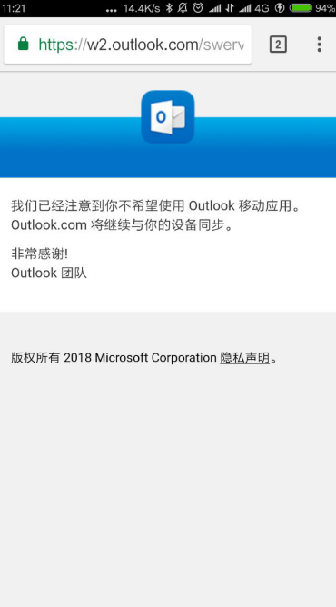

5. 等待一段时间，我们就能在手机的日历上看到课表了。

   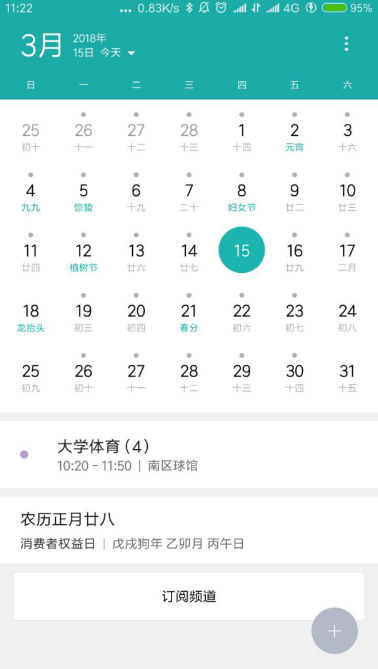

6. 我们可以在日历的账户信息中选择显示哪个账户的日历

   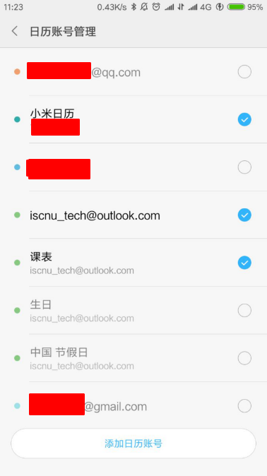

文档作者：qing

图片素材：qing、Meadow、Yuxuan、前背锅侠

有什么疑问的话可在 ISCNU 微信公众号后台留言

ISCNU 网络协会技术部出品
